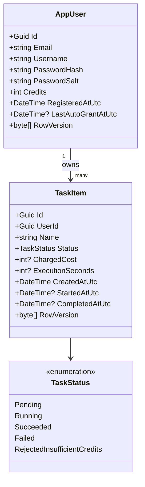

# CreditTasksApi (.NET 8)

A .NET 8 Web API that manages **user credits** and **tasks**. Credits are not spent directly; they are consumed exactly once **when a task executes**.

## Key Business Rules Implemented

- **Starting credits:** 500 credits on registration
- **Auto-grant:** +100 credits **every 3 days per user**, anchored to their **registration date**
- **Credits never go negative:** tasks are **rejected** if execution would make the balance negative
- **Task creation is free**
- **Task cost:** random integer **1–15** (inclusive), computed at execution time
- **Task duration:** random **10–40 seconds**, simulated with async delay
- **Idempotent execute:** the **same task is charged exactly once**, even if `/execute` is retried
- **Concurrency-safe:** multiple tasks per user may execute concurrently without corrupting credits

> Note: Task success/failure is randomized (75% success). Credits are **not refunded** on failure.

## How to Run

### Prerequisites
- .NET SDK **8.x**

### Run
```bash
cd CreditTasksApi/CreditTasksApi
dotnet restore
dotnet run
```

Swagger:
- `http://localhost:5213/swagger` (HTTP)
- `https://localhost:7213/swagger` (HTTPS)

Database:
- SQLite file at `CreditTasksApi/CreditTasksApi/data/app.db` (created automatically)

## Authentication

JWT Bearer tokens.

1) Register → returns token  
2) Use token as:
```
Authorization: Bearer <token>
```

## Endpoints

### Auth
- `POST /auth/register`
```json
{ "email": "a@b.com", "username": "ags", "password": "StrongPass123" }
```

- `POST /auth/login`
```json
{ "emailOrUsername": "a@b.com", "password": "StrongPass123" }
```

### Me
- `GET /me` → returns user info + current credits (also applies any due auto-grants)

### Tasks
- `POST /tasks` (create task)
```json
{ "name": "My first task" }
```

- `GET /tasks` (list up to last 100)
- `GET /tasks/{id}`
- `POST /tasks/{id}/execute`
  - Charges credits once (or rejects if insufficient)
  - Simulates work 10–40 seconds
  - Final status: `Succeeded` / `Failed` / `RejectedInsufficientCredits`

## Idempotency & Concurrency (How it’s guaranteed)

- A task starts in `Pending`.
- On the first successful execute:
  - cost is generated and stored in `TaskItem.ChargedCost`
  - user credits are deducted
  - status becomes `Running`
- Retries:
  - if status is not `Pending`, the API returns the existing status and **does not charge again**
- Concurrency:
  - `RowVersion` is used as an optimistic concurrency token on both `AppUser` and `TaskItem`
  - transactions + retry loops handle `DbUpdateConcurrencyException` safely

## Auto-grant “restart-safe” behavior

No background job is required.

Auto-grants are computed and applied **inside a transaction** whenever:
- `GET /me` runs, or
- tasks execute (also ensures grants even if user never calls `/me`)

We store `LastAutoGrantAtUtc` in the user row. This makes it safe across restarts and safe under concurrency.

## Assumptions / Trade-offs

- **EF Core EnsureCreated** is used instead of migrations (keeps the project runnable without scaffolding tools here).
- Auto-grants are applied on-demand (on API calls) rather than via a scheduler (simpler, restart-safe).
- Random success/failure rate is chosen (75% success) since no probability was specified.

## Class Diagram

See: `class-diagram.mmd` (Mermaid) or below.


